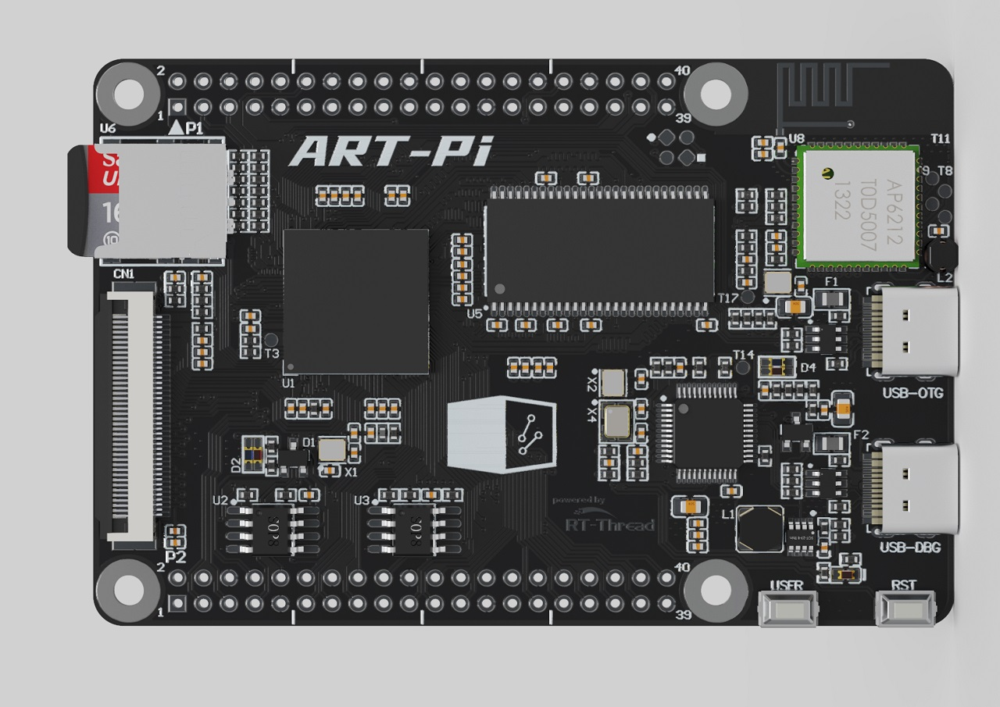

# STM32H750-artpi 开发板 BSP 说明

## 简介

中文页 | [English Page](README.md)

sdk-bsp-stm32h750-realthread-artpi 是 RT-Thread 团队对 ART-Pi 开发板所作的支持包，也可作为用户开发使用的软件SDK，让用户可以更简单方便的开发自己的应用程序。

ART-Pi 是 RT-Thread 团队经过半年的精心准备，专门为嵌入式软件工程师、开源创客设计的一款极具扩展功能的 DIY 开源硬件。

如果您想了解更多关于 **ART-Pi** 最新的开源扩展硬件及技术分享文章，请访问 [ART-Pi主页](https://art-pi.gitee.io/website/)。

## 目录结构

```
$ sdk-bsp-stm32h750-realthread-artpi 
├── README.md
├── RealThread_STMH750-ART-Pi.yaml
├── debug
├── documents
│   ├── coding_style_cn.md
│   ├── RT-Thread 编程指南.pdf
│   ├── UM5001-RT-Thread ART-Pi 快速上手.md
│   ├── UM5002-RT-Thread ART-Pi 开发手册.md
│   ├── UM5003-RT-Thread ART-Pi BT_WIFI 模块固件下载手册.md
│   ├── UM5004-RT-Thread ART-Pi 代码贡献手册.md
│   ├── board
│   └── figures
├── libraries
│   ├── STM32H7xx_HAL
│   ├── drivers
│   ├── rt_ota_lib
│   └── wlan_wiced_lib
├── projects
│   ├── art_pi_blink_led
│   ├── art_pi_bootloader
│   ├── art_pi_factory
│   ├── art_pi_wifi
│   └── industry_io_gateway
├── rt-thread
└── tools
```

- RealThread_STMH750-ART-Pi.yaml
  描述 ART-Pi 的硬件信息
- debug
  QSPI FLASH 下载算法等
- documents
  图纸，文档，图片以及 datasheets 等
- libraries
  STM32H7 固件库，通用外设驱动，rt_ota 固件库，wlan 固件库等
- projects
  示例工程文件夹，包含出厂程序，网关程序等
- rt-thread
  rt-thread 源码
- tools
  wifi 固件，BT 固件，rbl 打包工具等

## 文档

本文档 为 STM32H750-ART-PI 开发板提供的 BSP (板级支持包) 说明。

主要内容如下：

- 开发板资源介绍
- BSP 快速上手
- 进阶使用方法

通过阅读快速上手章节开发者可以快速地上手该 BSP，将 RT-Thread 运行在开发板上。在进阶使用指南章节，将会介绍更多高级功能，帮助开发者利用 RT-Thread 驱动更多板载资源。

## 开发板介绍

STM32H750 是RTTHREAD推出的一款基于 ARM Cortex-M7 内核的开发板，最高主频为 480Mhz，该开发板具有丰富的板载资源，可以充分发挥 STM32H750 的芯片性能。

开发板外观如下图所示：



该开发板常用 **板载资源** 如下：

- MCU：STM32H750，主频 480MHz，128KB FLASH, 1MB RAM
- 常用接口：USB 转串口、USB OTG、RGB888等
- 调试接口，标准 ST-LINK

开发板更多详细信息请参考 [H750-ART-PI](https://www.rt-thread.org/product/153.html)。

官方仓库 [sdk-bsp-stm32h750-realthread-artpi](https://github.com/RT-Thread-Studio/sdk-bsp-stm32h750-realthread-artpi)

官方主页 [ART-PI](https://art-pi.gitee.io/website)

## 外设支持

本 BSP 目前对外设的支持情况如下：

| **板载外设** | **支持情况** | **备注**                  |
| :----------- | :----------: | :------------------------ |
| LED          |    待支持    | 一个红灯，一个蓝灯        |
| BUTTON       |    待支持    | 一个用户可控button        |
| QSPI  FLASH  |    待支持    | 1MB w25q64  QSPI接口FLASH |
| SPI  FLASH   |    待支持    | 2MB w25q128 SPI FLASH     |
| SDCARD       |    待支持    | sdcard接口                |
| AP6212       |    待支持    | WIFI & BLUETOOTH          |
| LCD RG888    |    待支持    | 显示屏接口                |
| **片上外设** | **支持情况** | **备注**                  |
| GPIO         |     支持     |                           |
| UART         |     支持     | UART4 UART3               |
| SPI          |     支持     | SPI                       |
| QSPI         |     支持     |                           |
|              |              |                           |


## 使用说明

使用说明分为如下两个章节：

- 快速上手

    本章节是为刚接触 RT-Thread 的新手准备的使用说明，遵循简单的步骤即可将 RT-Thread 操作系统运行在该开发板上，看到实验效果 。

- 进阶使用

    本章节是为需要在 RT-Thread 操作系统上使用更多开发板资源的开发者准备的。通过使用 ENV 工具对 BSP 进行配置，可以开启更多板载资源，实现更多高级功能。


### 快速上手

本 BSP 为开发者提供 MDK5 和 IAR 工程，并且支持 GCC 开发环境。下面以 MDK5 开发环境为例，介绍如何将系统运行起来。

#### 硬件连接

使用数据线连接开发板到 PC，将 TVCC 接到 3.3V。使用 usb 转串口工具连接 TTLRX 和 TTLTX。

#### 编译下载

双击 project.uvprojx 文件，打开 MDK5 工程，编译并下载程序到开发板。

> 工程默认配置使用 ST_LINK 仿真器下载程序，在通过 ST_LINK 连接开发板的基础上，点击下载按钮即可下载程序到开发板

#### 运行结果

下载程序成功之后，系统会自动运行，LED闪烁。

连接开发板对应串口到 PC , 在终端工具里打开相应的串口（115200-8-1-N），复位设备后，可以看到 RT-Thread 的输出信息:

```bash
 \ | /
- RT -     Thread Operating System
 / | \     4.0.2 build Oct 25 2019
 2006 - 2019 Copyright by rt-thread team
msh >
```
### 进阶使用

此 BSP 默认只开启了 GPIO 和 串口1 的功能，如果需使用更多高级功能，需要利用 ENV 工具对BSP 进行配置，步骤如下：

1. 在 bsp 下打开 env 工具。

2. 输入`menuconfig`命令配置工程，配置好之后保存退出。

3. 输入`pkgs --update`命令更新软件包。

4. 输入`scons --target=mdk4/mdk5/iar` 命令重新生成工程。

本章节更多详细的介绍请参考 [STM32 系列 BSP 外设驱动使用教程](../docs/STM32系列BSP外设驱动使用教程.md)。

## 注意事项

- 调试串口为串口4 映射说明

    PI9  ------> USART4_RX

    PA0 ------> USART4_TX 

- Bootloader 损坏 或 缺失

    如遇到程序下载后，板子跑不起来的情况，请先通过串口查看复位后bootloader打印信息 “ART-PiBOOT” ，以检查bootloader是否损坏或丢失。若 bootloader 缺失，则需要重新烧写目录下 artpi_bootloader.bin 文件到芯片内部flash；在连接开发板至 PC 后，ART-Pi 会显示为存储设备，直接将 artpi_bootloader.bin 拖入文件管理器中 ART-Pi 目录下即可（类似复制文件）。

    此 bin 文件由 ART-Pi sdk 下 art_pi_bootloader 示例工程构建生成，生成过程参考 [ART-Pi 开发手册](https://github.com/RT-Thread-Studio/sdk-bsp-stm32h750-realthread-artpi/blob/master/documents/UM5002-RT-Thread%20ART-Pi%20%E5%BC%80%E5%8F%91%E6%89%8B%E5%86%8C.md) ；工程构建后，bin 文件生成在工程目录 Debug 路径下。
    
- 外部 flash 下载算法

    参考 [ART-Pi 常见问题说明文档](https://github.com/RT-Thread-Studio/sdk-bsp-stm32h750-realthread-artpi/blob/master/documents/UM5005-RT-Thread%20ART-Pi%20%E5%B8%B8%E8%A7%81%E9%97%AE%E9%A2%98%E8%A7%A3%E7%AD%94.md) ，解决MDK5无法下载程序的问题。

## 联系人信息

ART-Pi 是一个开源创意硬件平台，期待有更多的小伙伴能一起发现更多的乐趣，在使用过程中若您有任何的想法和建议，建议您通过以下方式来联系到我们。

RT-Thread [社区论坛](https://club.rt-thread.org/)。

-  ART-Pi 官方交流 QQ 群(1016035998)。

## 贡献代码

如果您对 ART-Pi 感兴趣，并有一些好玩的项目愿意与大家分享，欢迎给我们贡献代码，您可以参考 [ART-Pi 代码贡献手册](https://github.com/RT-Thread-Studio/sdk-bsp-stm32h750-realthread-artpi/blob/master/documents/UM5004-RT-Thread ART-Pi 代码贡献手册.md) 。


## 使用

sdk-bsp-stm32h750-realthread-artpi 支持 RT-Thread Studio 和 MDK 开发

### RT-Thread Studio 开发


1. 打开 RT-Thread Studio 的包管理器，安装 ART-PI SDK 资源包

   


2. 安装完成后，选择基于 BSP 创建工程即可

   

### MDK 开发

为了避免 SDK 在持续更新中，每一个 `projects` 都创建一份 `rt-thread` 文件夹 和 `libraries` 文件夹导致的 SDK 越来越臃肿，所以这些通用文件夹被单独提取了出来。这样就会导致直接打开 `MDK` 的工程编译会提示缺少上述两个文件夹的文件，我们有两个方法来解决这个问题：

**方法一：**

1. 双击 `project` 目录下的 `mklinks.bat` 文件，如 `sdk-bsp-stm32h750-realthread-artpi\projects\art_pi_blink_led` 目录下的 `mklinks.bat`

2. 查看 `sdk-bsp-stm32h750-realthread-artpi\projects\art_pi_blink_led` 目录下是否有 `rt-thread` 和 `libraries` 的文件夹图标
3. 使用 [ENV](https://club.rt-thread.org/ask/question/5699.html) 工具执行 scons --target=mdk5 更新 MDK5 工程文件

**方法二**

1. 在 [ART-Pi SDK仓库](https://github.com/RT-Thread-Studio/sdk-bsp-stm32h750-realthread-artpi) 下载 SDK

2. 进入工程目录。如：sdk-bsp-stm32h750-realthread-artpi\projects\art_pi_blink_led

3. 使用 [ENV](https://club.rt-thread.org/ask/question/5699.html) 工具执行 mklink 命令，分别为 `rt-thread` 及 `libraries` 文件创建符号链接

   ```
   E:\project\sdk-bsp-stm32h750-realthread-artpi\projects\art_pi_blink_led>mklink /D rt-thread ..\..\rt-thread
   symbolic link created for rt-thread <<===>> ..\..\rt-thread
   
   E:\project\sdk-bsp-stm32h750-realthread-artpi\projects>mklink /D libraries ..\..\libraries
   symbolic link created for libraries <<===>> ..\..\libraries
   
   E:\project\sdk-bsp-stm32h750-realthread-artpi\projects>
   ```

4. 使用 [ENV](https://club.rt-thread.org/ask/question/5699.html) 工具执行 scons --target=mdk5 更新 MDK5 工程文件


## ART-Pi 交流平台

ART-Pi  是一个开源创意硬件平台，期待有更多的小伙伴能一起发现更多的乐趣，在使用过程中若您有任何的想法和建议，建议您通过以下方式来联系到我们。

ART-Pi [官网](http://art-pi.gitee.io/website)。

RT-Thread [社区论坛](https://club.rt-thread.org)。

ART-Pi 官方交流 QQ 群(1016035998)。


## 贡献代码

如果您对 ART-Pi 感兴趣，并有一些好玩的项目愿意与大家分享，欢迎给我们贡献代码，您可以参考 [ART-Pi 代码贡献手册](https://github.com/RT-Thread-Studio/sdk-bsp-stm32h750-realthread-artpi/blob/master/documents/UM5004-RT-Thread%20ART-Pi%20%E4%BB%A3%E7%A0%81%E8%B4%A1%E7%8C%AE%E6%89%8B%E5%86%8C.md) 。

## 参与项目

可以参与哪些项目：

- 维护现有 SDK 仓库代码
- 提交工程代码可以合并到 SDK 仓库
- 提交展示工程，代码无法合并到 SDK 仓库，但是代码开源在其他地方
- 提交扩展板
- 撰写专栏文章

详情请参考：http://art-pi.gitee.io/website/docs/#/tutorial/share-guide